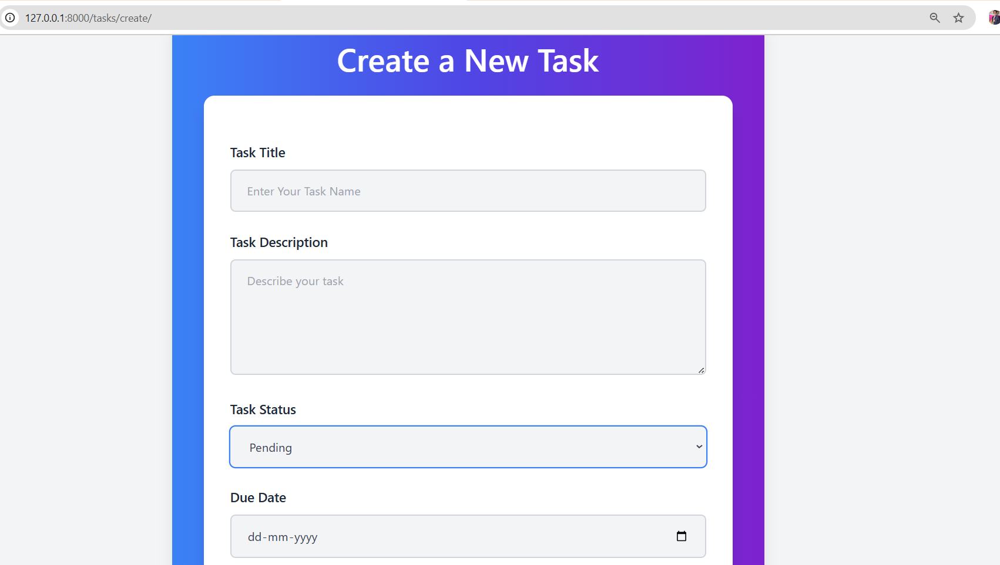
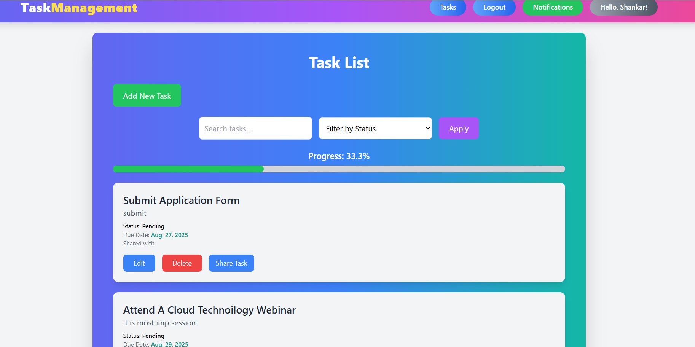

# 📝 Task Management System (Django + DRF)

A **modern Task Tracking Web Application** built with **Django, Django REST Framework, TailwindCSS, and Chart.js**.
It helps users manage personal tasks, collaborate with others, track progress, and view analytics.

## 🚀 Features

* 🔑 **Authentication System**

  * Register, Login, Logout (Ref: README-1 & 2)
  * Session-based security
* ✅ **Task Management**

  * CRUD Operations (Create, Update, Delete, View)
  * Fields: Title, Description, Status (Pending/In Progress/Completed), Due Date (Ref: README-1)
  * File Upload Support (Ref: README-2)
* 📂 **Task Sharing & Notifications**

  * Share tasks with other users (Ref: README-2)
  * Notification system for updates (Ref: README-1 & 2)
* 📊 **Admin Analytics Dashboard**

  * Task statistics with charts (Ref: README-1 & 2)
  * Weekly & Monthly trends using Chart.js (Ref: README-2)
* 🔎 **Search & Filters**

  * Search tasks by title
  * Filter tasks by status/due date (Ref: README-1)
* 🎨 **Responsive UI**

  * TailwindCSS-based modern design
  * Mobile-friendly layouts
* 💾 **Database**

  * SQLite (default), supports PostgreSQL/MySQL
* 🔒 **Authentication**

  * Django’s built-in auth system with token support

---

## 📂 Project Structure 

```
Task_Tracker/
│── Task_Tracker/        # Main project folder
│   ├── settings.py
│   ├── urls.py
│   └── ...
│
│── tasks/               # Application folder
│   ├── models.py
│   ├── views.py
│   ├── urls.py
│   ├── serializers.py
│   ├── forms.py
│   └── ...
│
│── templates/           # HTML templates
│   ├── base.html
│   ├── tasks/
│   │   ├── dashboard.html
│   │   ├── login.html
│   │   ├── register.html
│   │   ├── form.html
│   │   └── tasklist.html
│
│── static/              # Static files
│   ├── css/form.css
│   └── js/app.js
│
│── manage.py
```

---

## 📡 API Endpoints

### Authentication

| Endpoint         | Method | Description                   |
| ---------------- | ------ | ----------------------------- |
| `/api/register/` | POST   | Register a new user           |
| `/api/login/`    | POST   | Authenticate and return token |
| `/api/logout/`   | POST   | Logout the user               |

### Tasks

| Endpoint           | Method | Description            |
| ------------------ | ------ | ---------------------- |
| `/api/tasks/`      | GET    | Get all tasks for user |
| `/api/tasks/`      | POST   | Create a new task      |
| `/api/tasks/<id>/` | GET    | Get task details       |
| `/api/tasks/<id>/` | PUT    | Update task            |
| `/api/tasks/<id>/` | DELETE | Delete task            |

### Search & Filter

| Endpoint                     | Method | Description              |
| ---------------------------- | ------ | ------------------------ |
| `/api/tasks/search/?q=`      | GET    | Search tasks by title    |
| `/api/tasks/filter/?status=` | GET    | Filter tasks by status   |
| `/api/tasks/filter/?date=`   | GET    | Filter tasks by due date |

---

## ⚙️ Installation & Setup

1. **Clone Repository**

   ```bash
   git clone https://github.com/your-username/task-tracker.git
   cd task-tracker
   ```

2. **Create Virtual Environment**

   ```bash
   python -m venv venv
   source venv/bin/activate   # Linux/Mac
   venv\Scripts\activate      # Windows
   ```

3. **Install Dependencies**

   ```bash
   pip install -r requirements.txt
   ```

4. **Apply Migrations**

   ```bash
   python manage.py makemigrations
   python manage.py migrate
   ```

5. **Create Superuser**

   ```bash
   python manage.py createsuperuser
   ```

6. **Run Development Server**

   ```bash
   python manage.py runserver
   ```

7. Visit → [http://127.0.0.1:8000/](http://127.0.0.1:8000/)

---

## 🔑 Default Routes

* Admin Dashboard → `/admin/`
* User Dashboard → `/dashboard/`

---

## 📊 Screenshots

### 🔐 Login Page


### 📋 Task List


### 📈 Analytics Dashboard



---

## 🛠️ Tech Stack

* **Backend**: Django 4.2+ / Django 5, Django REST Framework
* **Frontend**: HTML, TailwindCSS, JavaScript, Chart.js
* **Database**: SQLite (default)
* **Auth**: Django Authentication

---

## 📚 References

* [Django Docs](https://docs.djangoproject.com/)
* [Django REST Framework](https://www.django-rest-framework.org/)
* [Tailwind CSS](https://tailwindcss.com/docs)
* [Chart.js](https://www.chartjs.org/docs/latest/)

---

## 👨‍💻 Author

Developed by **Shankar Sable**
📅 June 2025

---

✅ Now you have **one professional README** with references to both of your files.

Do you want me to also make a **shorter “lite README” version** (just highlights + setup) for GitHub repo front page, and keep this full one as `README_FULL.md`?
